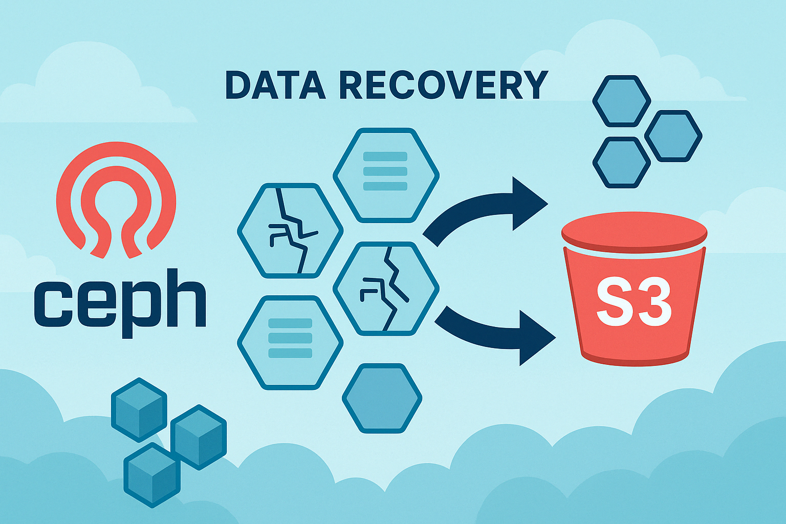
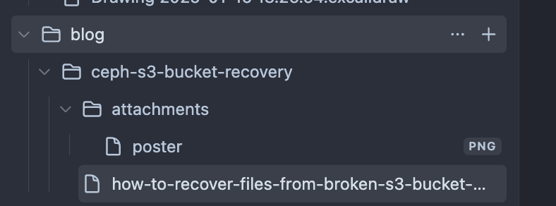

# Introduction!

In this case study I want to describe how I was able to recover objects from a Ceph RADOS Gateway (RGW) pool after several placement groups (PGs) became irrecoverably corrupted. Unable to use the standard S3 API, I demonstrate how to leverage the `rados` CLI, craft custom scripts to list and download objects directly from the underlying RADOS pool, and reconcile partial data loss while restoring service availability.

# Background

Ceph's RGW provides an S3-compatible storage interface backed by an underlaying RADOS pool. Data is internally sharded across many PGs according to CRUSH rules. Under normal operation